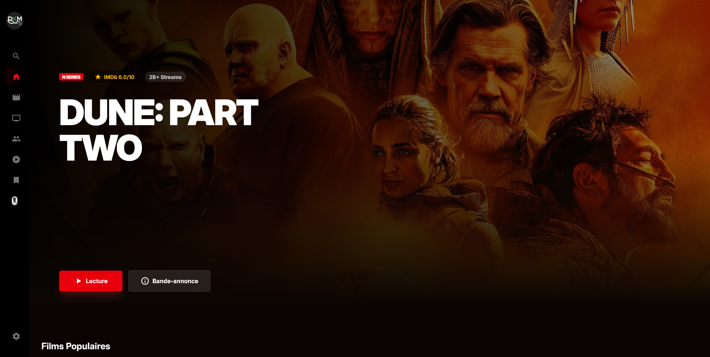
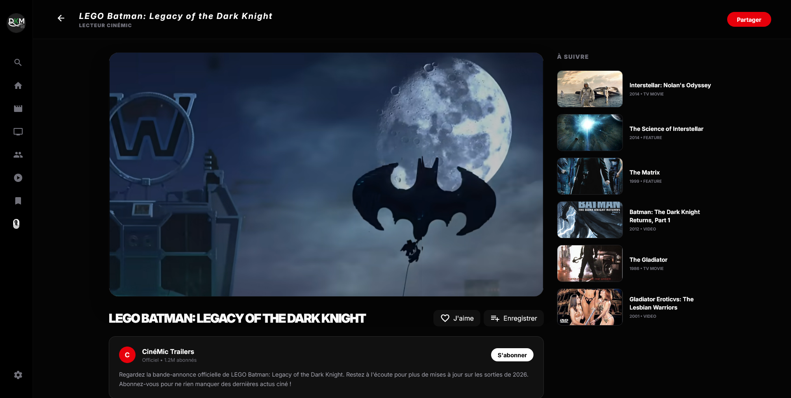
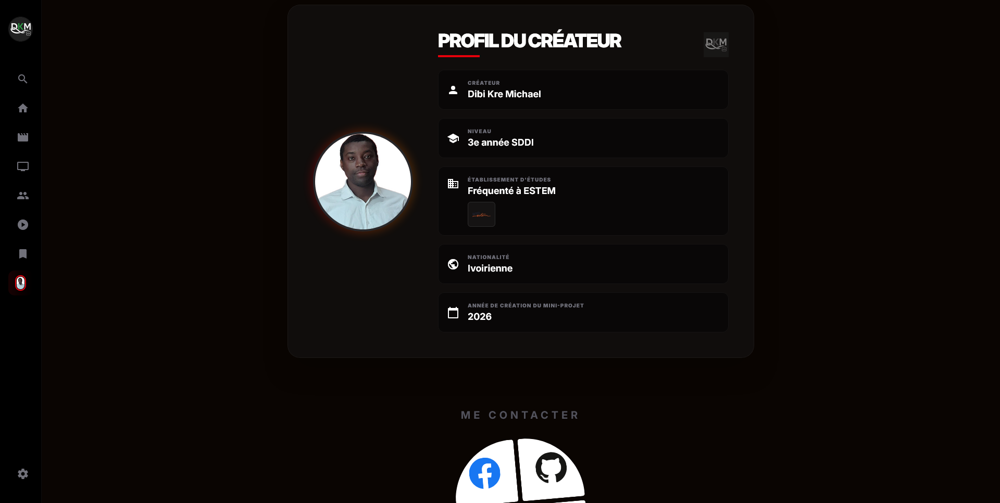

# CinéMic

**CinéMic** est une plateforme web moderne et immersive de découverte cinématographique. Développée avec les dernières technologies du Web, elle permet d'explorer les tendances du septième art, de rechercher vos films et séries préférés, de consulter des biographies détaillées d'acteurs, de gérer vos favoris et de visionner des bandes-annonces directement via un lecteur vidéo dynamique intégré.

---

## Aperçu du Projet

### 1. Page d'Accueil & Univers Visuel
La page d'accueil propose une expérience visuelle hautement immersive avec un bandeau **Hero** dynamique qui joue directement la bande-annonce du film vedette du moment. Toutes les listes de films et de séries populaires sont intelligemment randomisées à chaque visite pour garantir une diversité maximale de suggestions dès la connexion.

> **[Insérer ici : Capture d'écran de l'Accueil / Section Hero de CinéMic]**
> *Exemple : `public/captures/accueil.png`*
<!--  -->

---

## Fonctionnalités Clés

- **Recherche Ultra-Rapide (IMDb Autocomplete) :** Suggestions instantanées lors de la saisie grâce à l'intégration de l'API de suggestion autocomplétée officielle d'IMDb.
- **Lecteur Vidéo Avancé :** Lecture fluide des bandes-annonces de films via l'intégration officielle de l'API YouTube (activable/désactivable dans les paramètres).
- **Fiches de Détails Riches :** Accès aux synopsis complets, années de sortie, genres, notes, acteurs associés et recommandations personnalisées "Prêt pour la séance ?".
- **Recommandations Verticales Intelligentes :** 5 propositions de films complémentaires sur chaque page de détails, adaptées de manière fluide à l'expérience de lecture.
- **Gestion des Favoris :** Enregistrement local et sécurisé de vos films, séries et acteurs préférés pour y accéder rapidement depuis votre espace personnel.
- **Profil Créateur Personnalisé :** Une section dédiée à la présentation du créateur de l'application, enrichie de son parcours (notamment ses études à l'**ESTEM**), et d'un tableau d'accès rapide à ses différents réseaux sociaux (Facebook, GitHub, LinkedIn, Email).
- **Navigation Mobile Intuitive :** Menu latéral adaptatif avec bouton d'expansion/réduction fluide (flèche de glissement vers la droite) pour une navigation optimale sur tous les écrans.

> **[Insérer ici : Capture d'écran du Lecteur et Recommandations ou de la Page Détail]**
> *Exemple : `public/captures/details_lecteur.png`*
<!--  -->

---

## Stack Technique

CinéMic bénéficie d'une architecture full-stack robuste et ultra-fluide :

- **Frontend (Framework) :** **Angular 21+**
  - **Zoneless :** L'application n'utilise pas `zone.js`, optimisant ainsi les performances de rendu grâce à l'utilisation native des **Signals** d'Angular pour la gestion d'état réactive.
  - **Change Detection :** Stratégie optimisée `OnPush` pour des gains de performance notables.
- **Design & Styles :** **Tailwind CSS v4+**
  - Une palette de couleurs sombre, soignée et cinématographique (zinc, noir profond, rouge cinéma éclatant) offrant un contraste saisissant de jour comme de nuit.
  - Transitions fluides, micro-animations interactives et retour haptique visuel (`active:scale-95`).
- **Backend (SSR & Proxies d'API) :** **Express / Node.js**
  - Traitement sécurisé côté serveur pour masquer et relayer de manière sécurisée les requêtes vers les API tierces (OMDb, YouTube).

---

## Gestion des Clés d'API (OMDb & YouTube)

Pour une sécurité maximale et une flexibilité d'utilisation, CinéMic propose un double mécanisme de gestion des clés d'API :

1. **Variables d'Environnement (Côté Serveur) :**
   Les clés globales d'administration peuvent être configurées directement sur le serveur d'hébergement via les variables d'environnement suivantes :
   - `OMDB_API_KEY`
   - `YOUTUBE_API_KEY`

2. **Configuration Manuelle Utilisateur (Côté Client - LocalStorage) :**
   Les utilisateurs peuvent également configurer leurs propres clés privées à l'aide de l'onglet **Configuration** dans le menu. Les clés sont encodées de manière sécurisée et persistées localement dans le navigateur (`LocalStorage`) sans jamais transiter en clair. Les requêtes s'adaptent alors automatiquement pour utiliser vos clés personnelles préférées.

---

## Installation et Démarrage Local

### Prérequis
- [Node.js](https://nodejs.org/) (Version 18 ou supérieure recommandée)
- [Angular CLI](https://angular.dev/tools/cli) installé globalement (`npm install -g @angular/cli`) ou exécuté localement
- un gestionnaire de paquets (npm, yarn, etc.)

### Instructions

1. **Cloner le répertoire du projet :**
   ```bash
   git clone <URL_DU_DEPOT>
   cd <NOM_DU_DEPOT>
   ```

2. **Installer les dépendances du projet :**
   ```bash
   npm install
   ```

3. **Lancer le serveur de développement Angular :**
   Vous pouvez démarrer l'environnement de développement local et ouvrir automatiquement l'application dans votre navigateur par défaut en utilisant la commande Angular CLI officielle :
   ```bash
   ng serve --open
   ```
   L'application sera compilée et s'ouvrira localement dans votre navigateur, par défaut sur `http://localhost:4200` (ou sur un autre port configuré, comme `http://localhost:3000` selon l'environnement).

4. **Vérifier le linter (Qualité du code Angular) :**
   ```bash
   npm run lint
   ```

5. **Lancer les tests unitaires :**
   ```bash
   npm run test
   ```

6. **Compiler l'application pour la production (Build d'optimisation AOT) :**
   ```bash
   npm run build
   ```
   Les fichiers compilés et optimisés de manière statique et serveur seront prêts dans le dossier `dist/`.

---

## Contact et Réseaux

Retrouvez et connectez-vous avec le créateur de cette application :

> **[Insérer ici : Capture d'écran de l'espace Profil et Réseau du Créateur]**
> *Exemple : `public/captures/profil_createur.png`*
<!--  -->

- **Facebook :** [Dibi-Kré Michaël](https://www.facebook.com/kremichael.diby)
- **GitHub :** [@dibikre](https://github.com/dibikre)
- **LinkedIn :** [Dibi Kré Michaël](https://www.linkedin.com/in/dibi-kre-michael/)
- **Email :** [dibikremichael@gmail.com](mailto:dibikremichael@gmail.com)

---
*Fait avec passion par Dibi-Kré Michaël — Étudiant à l'ESTEM.*
